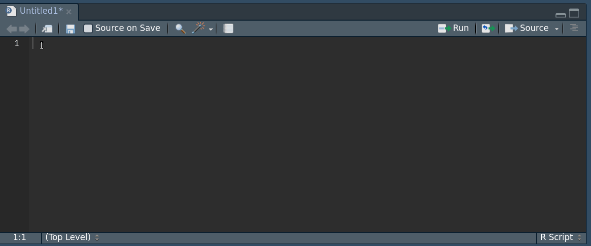
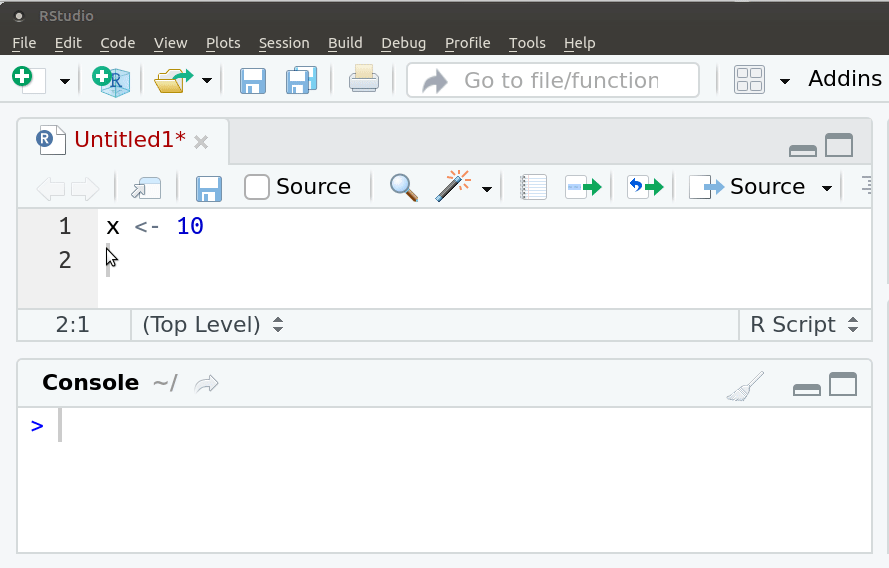
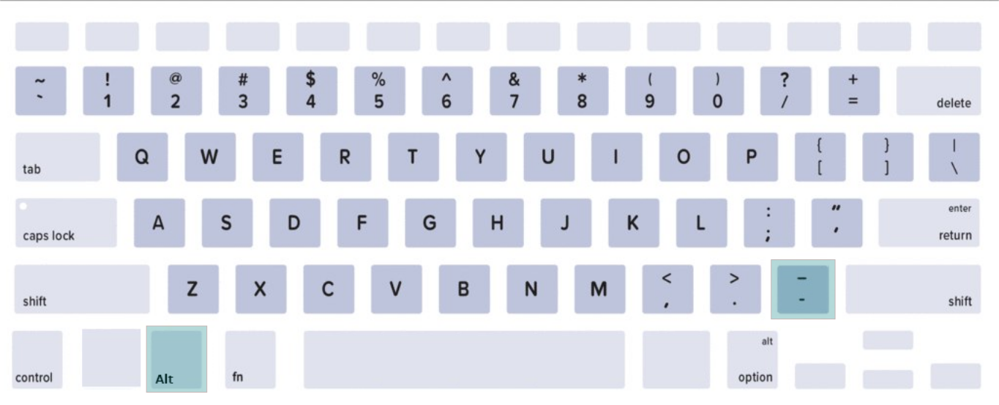
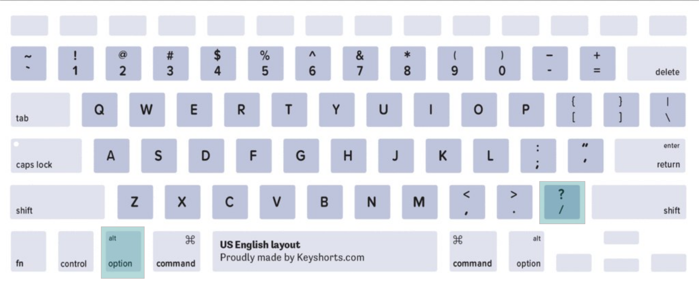

```{r, include = F}
# This is the recommended set up for flipbooks
# you might think about setting cache to TRUE as you gain practice --- building flipbooks from scratch can be time consuming
knitr::opts_chunk$set(fig.width = 6, message = FALSE, warning = FALSE, comment = "", cache = FALSE, fig.retina = 3)
library(flipbookr)
library(tidyverse)
library(flair)
library(kableExtra)
```
```{r xaringan-themer, include=FALSE, warning=FALSE}
library(xaringanthemer)
style_duo_accent(
  #base_color = "#43a2ca",
  header_font_google = google_font("Mukta"),#Ubuntu Condensed
  text_font_google   = google_font("Montserrat", "300", "300i"),
  code_font_google   = google_font("Fira Mono"),
  primary_color      = "#0F4C81", # pantone classic blue
  secondary_color    = "#b3e2cd", # pantone baby blue
  #header_font_google = google_font("Raleway"),
  #text_font_google   = google_font("Raleway", "300", "300i"),
  #code_font_google   = google_font("Source Code Pro"),
  text_font_size     = "25px"
#   colors = c(
#   red = "#f34213",
#   purple = "#3e2f5b",
#   orange = "#ff8811",
#   green = "#136f63",
#   white = "#FFFFFF",
# )
)

```

```{r, include=FALSE}
text_spec2 <- function(x = "x"){
  text_spec(x, background = "#b3e2cd", bold = T)
}
```

class: hide-logo
# Características del curso

```{r setup, include=FALSE}
options(htmltools.dir.version = FALSE)
knitr::opts_chunk$set(warning = FALSE, message = FALSE)
```


.left-column[
`r icon::fa("laptop-code", size=2, color = "#43a2ca")` 
<br>

`r icon::fa("link", size=2, color = "#43a2ca")` 
<br>

`r icon::fa("question", size=2, color = "#43a2ca")` 
<br>

`r icon::fa("file-alt", size=2, color = "#43a2ca")` 
<br>

`r icon::fa("home", size=2, color = "#43a2ca")` 
<br>

`r icon::fa("comments", size=2, color = "#43a2ca")` 
]
.right-column[
Espacio "presencial": `r text_spec2("16 horas")` de clases teóricas/prácticas
<br>

<a href="https://webasignatura.ucu.edu.uy/course/view.php?id=6789">Espacio virtual</a>
<br>

Participar durante la clase a través del `r text_spec2("chat")` de zoom o `r text_spec2("pedir la palabra")`.
<br><br>

`r text_spec2("Examen")` opcional
<br><br>

`r text_spec2("Dedicación:")` durante el curso y después ... es la .red[clave]
<br>

Comunicación: `r text_spec2("foro y mail")`
]

---
# Objetivos del curso 

- Introducción al lenguaje `r text_spec2("R")` mediante `r text_spec2("RStudio")`

- Manejar un gran conjunto de `r text_spec2("funciones: básicas y más avanzadas")`

- Generar `r text_spec2("autonomía")` para usar R y `r text_spec2("seguir aprendiendo")` después del curso

- Aprender a programar en R a través de la `r text_spec2(" lógica tidyverse")` para lograr rápidamente:

  - Trabajar con `r text_spec2("datos reales")` e interesantes.

  - `r text_spec2("Procesar")` y transformar los datos. 

  - Crea `r text_spec2("visualizaciones")` atractivas e informativas.

---
class: hide-logo
# ¿Qué haremos hoy?

- `r text_spec2("¿Qué es R?")`
<br>
--

- Usar R como  `r text_spec2("calculadora")`
<br>
--

- Conceptos básicos: `r text_spec2("objetos y clase de objetos")`
<br><br>
--

-  `r text_spec2("Vectores")`: numéricos, lógicos y de caracteres
<br>
--

-  `r text_spec2("Funciones")` y `r text_spec2("operadores")`
<br>
--

- Marco de datos (`r text_spec2("data frame")`)
<br><br>
--

- `r text_spec2("Importar")` un archivo csv
<br>
--

-  `r text_spec2("Explorar")` un conjunto de datos (data frame)
<br><br>
--

- Extensiones a R base: `r text_spec2("paquetes")`
<br>
--

- Paquete `r text_spec2("tidyverse")`
<br><br>
--

- ¿Qué es un `r text_spec2("script")`?
<br>
--

- Alternaremos entre `r text_spec2("ejemplos")` y `r text_spec2("ejercicios")`

---
class: hide-logo
# ¿Qué es `r icon::fa_r_project(colour = "#384CB7")`?

.left-column[

`r icon::fa("chart-area", size=2, color="#756bb1")` <br>

`r icon::fa("code", size=2, color="#2c7fb8")` <br>

`r icon::fa("creative-commons-nc", size=2, color="#636363")` <br> 

`r icon::fa("osi", size=2, color="#31a354")` <br>

`r icon::fa("github", size=2)` <br>

`r icon::fa("meetup", size=2, color="#de2d26")`
]

.rigth-column[

`r text_spec2("Programa estadístico")`: análisis
<br><br>

`r text_spec2("Lenguaje")` de programación: sintaxis
<br><br>

Software `r text_spec2("gratuito")`, se desacarga desde [CRAN](http://www.r-project.org).
<br><br>

Software `r text_spec2("libre")`: licencia [GNU](https://es.wikipedia.org/wiki/GNU_General_Public_License). Libertad de uso, modificación y  distribución.
<br>

`r text_spec2("Comunidad")` mundial: lo usa y mejora. Casi 20.000 paquetes en [CRAN]((https://cran.r-project.org/web/packages/)) y [github](https://github.com/)
<br>

Comunidad en Uruguay: [meetup R-Ladies](https://www.meetup.com/es-ES/rladies-montevideo/) y [meetup GURU](https://www.meetup.com/es-ES/GURU-mvd/)
]

---
# ¿Quiénes usan/usamos R?

<!-- [Visualizador](https://benubah.github.io/r-community-explorer/rugs-cluster-map.html) RUGs y R-Ladies -->

<iframe src="https://benubah.github.io/r-community-explorer/rugs-cluster-map.html"  width="1200" height="520" frameBorder="0"></iframe>

<!-- https://rpubs.com/anish20/StackOverflowDeveloperSurveyAnalysis -->

---
class: inverse, center, middle
# Intro R

---
class: hide-logo 
# Curva de aprendizaje

Al inicio suele ser empinada
<center>

</center>
<!--  -->

---
class: hide-logo
# ...

<center>

</center>

---
class: hide-logo
# Ayuda

El curso busca guiarlos por un camino menos empinado

<center>

</center>


---
class: hide-logo
# `r icon::fa("greater-than")` Abrimos RStudio


---
class: hide-logo
# ¿Cómo interactuamos con R?

.pull-left[
- Al abrir RStudio vemos el panel llamado "Console" que es la `r text_spec2("consola")` de R.

- R inicia con un `r text_spec2("mensaje")` de apertura que indica entre otras cosas, la versión.

]

.pull-right[
- Luego del mensaje de apertura, el 'prompt', `r text_spec2(">")`, indica que R está listo. 


<!--  -->
]
---
class: hide-logo
# ¿Cómo interactuamos con R?

- Es un lenguaje de programación: escribimos `r text_spec2("código")` en la consola para darle órdenes a R.

- Las `r text_spec2("órdenes")` elementales de R consisten en expresiones o asignaciones. 
--

- Una `r text_spec2("expresión")`, se evalúa, se imprime el resultado y su valor se pierde. 
```{r message=FALSE, warning=FALSE, paged.print=FALSE}
2 + 3  #<<
```
--

---
class: hide-logo
# ¿Cómo interactuamos con R?


- Una `r text_spec2("asignación")`, crea un objeto y no se imprime el resultado.
```{r flecha, include = FALSE}

x <- 2 + 3
```

```{r, echo = FALSE}

decorate("flecha") %>% 
  flair("<-")
  
```

--

- Una asignación se hace utilizando el símbolo: `r icon::fa("less-than")``r icon::fa("minus")` 
<br>
--

- Otros programas estadísticos muestran directamente los resultados, R los guarda en un `r text_spec2("objeto")`. 
<br>
--

- Ejecuto el nombre del objeto para imprimir/mostrar el resultado
```{r }
x 
```

---
class: hide-logo
# Operadores aritméticos
.pull-left[

- `r text_spec2("Suma")`

```{r sum, include = FALSE}
18 + 9
```

```{r, echo = FALSE}
decorate("sum") %>% 
  flair("+")
```


- `r text_spec2("Resta")`
```{r minus, include = FALSE}
18 - 9
```

```{r, echo = FALSE}
decorate("minus") %>% 
  flair("-")
```


]
.pull-right[

- `r text_spec2("Multiplicación")`

```{r por, include = FALSE}
18 * 9
```

```{r, echo = FALSE}
decorate("por") %>% 
  flair("*")
```

- `r text_spec2("División")`
```{r divido, include = FALSE}
18 / 9
```

```{r, echo = FALSE}
decorate("divido") %>% 
  flair("/")
```
]

---
class: hide-logo
# Ejercicio (3')

.pull-left[

- ¿Cuánto gasté en el super? 

- ¿Cuánto gasté en pesos uruguayos?

- Escribe la cuenta en la consola de R
]
<!--  -->

.pull-right[
```{r echo=FALSE, out.width="50%"}

```
<!--  -->

]

---
class: hide-logo
# Calculadora

- Además de los operadores aritméticos, trae `r text_spec2("funciones matemáticas")`

```{r}
# valor absoluto
abs(-1)
```
--

--
```{r}
# exponencial
exp(0)
```
--
```{r}
# raíz cuadrada
sqrt(9)
```

---
class: hide-logo
# Funciones

- Una  función  es un  conjunto  de  `r text_spec2("instrucciones")` que  operan  sobre unos `r text_spec2("argumentos")` y producen un `r text_spec2("resultado")`.
<br><br>
--

- Una función esconde líneas de código que permite reutilizarlo una y otra vez.
<br><br>
--

- Las funciones tienen `r text_spec2("nombres")` descriptivos -en inglés- y se acompañan de `r text_spec2("paréntesis curvos")`. Por ejemplo, `r text_spec2("sqrt()")` es la abreviación de square root (raíz cuadrada)
<br><br>
--

- Dentro de los paréntesis se definen los valores de sus argumentos:  `r text_spec2("sqrt(9)")`
<br><br>
--

- La mayoría tiene al menos un argumento obligatorio y el resto con valores por defecto. Usa la `r text_spec2("ayuda")` de R para saber qué hace una función:

```{r}
?sqrt 
help("sqrt")
```

---
class: inverse, center, middle
# RStudio

---
class: hide-logo
# [RStudio](https://www.rstudio.com/)
<!-- (IDE -integrated development environment-)  entorno de desarrollo integrado -->


---
class: hide-logo
# Ventanas de RStudio

<!--   -->

```{r out.width="120%", echo=FALSE}

```

`r fontawesome::fa("link", fill = "#43a2ca")` [Cheatsheet](https://resources.rstudio.com/the-essentials-of-data-science/rstudio-ide)

---
# Script


---
# Script

- Un archivo donde se `r text_spec2("escribe")` la sintaxis (el código) y luego se `r text_spec2("envía")` a la consola.
<br><br>
--

- Un script permite `r text_spec2("reproducir")` nuestro análisis o que otra persona lo haga.
<br><br>
--

- Tendrá una extensión `r text_spec2(".R")` y al hacer doble click sobre el archivo se abre RStudio.
<br><br>
--

- Es clave `r text_spec2("comentar")` el código, los comentarios deben ir precedidos por `r text_spec2("#")`.
<br><br>
--

- Los comentarios se verán de un color diferente al código, incluso cuando se comenta parte de un código.
<br><br>
--

- Un comentario se envía a la consola pero `r text_spec2("no se ejecuta")` nada. 

---
# Autocompleta código

La ventana de script  `r text_spec2("colorea y autocompleta")` código. Muestra el  `r text_spec2("help")`  de la función.



---
# Comentarios


---
class: hide-logo
# Ejecutar código

- Una sola línea: colocar el  `r text_spec2("cursor sobre esa línea")` y ejecutar  `r text_spec2("Ctrl + ENTER")`.


---
class: hide-logo
# Ejecutar código

- Varias líneas de código:  `r text_spec2("seleccionarlas todas")` y ejecutar  `r text_spec2("Ctrl + ENTER")`.


---
# Atajos de teclado

<center>

</center>


---
class: hide-logo
# Flecha: atajo de teclado en Linux/Windows
(teclado en español)



---
class: hide-logo
# Flecha: atajo de teclado en Mac 
(teclado en español)




---
# Atajos de teclado

```{r, out.height="100%", echo=FALSE, fig.align='center'}
knitr::include_graphics("img/teclas.png")
```

---
class: inverse, center, middle
# R 'base'

---
class: hide-logo
# Objetos

- R es un programa  `r text_spec2("'orientado a objetos'")`: variables, datos, funciones, resultados, etc., se guardan en la memoria RAM en forma de objetos con un nombre específico sin usar archivos temporales. 
<br><br>
--

- Cada `r text_spec2("clase de objeto")` tiene diferentes atributos que determinan la forma en que trabajan dentro de R, es decir, define cuáles funciones se le pueden aplicar. 
<br><br>
--

- Estos objetos se pueden modificar o manipular con  `r text_spec2("operadores")` y `r text_spec2("funciones")` --que a su vez son objetos--. 
<br><br>
--

- Bajo este término se esconde la simplicidad y flexibilidad de R. 
<br><br>
--

- Algunas de las clases más comunes de objetos son: 'numeric', 'character', 'logical' (son `r text_spec2("vectores")`), 'matrix' (`r text_spec2("matriz")`), 'data.frame' (`r text_spec2("marco de datos")`), 'list' (`r text_spec2("lista")`) y 'function' (`r text_spec2("función")`).

---
class: hide-logo
# Tipo de objetos

La cantidad de clases de objetos es muy grande y crece permanentemente a medida que se crean nuevos paquetes.

<!-- Casi en cada paquete existen funciones que devuelven objetos de clases únicas que sólo esa función puede -->
<!-- # generar y cuya interpretación y funcionalidad es específica del paquete en -->
<!-- # cuestión o de otros creados posteriormente y que dependen del mismo.  -->
<!-- Por ejemplo las clases "igraph" o "Spatial" de los paquetes igraph y sp definen  -->
<!-- # objetos asociados a trabajo con grafos y datos espaciales respectivamente. -->


| Objeto      | Dimensión o largo           | Tipo de elementos | Ejemplo
|---------------|:-------------:|:------:|:------:|
| Vector    | length() | homogéneos |`r icon::fa_ellipsis_v(colour="#5e3c99", size=3)` |
| Matriz   | dim() | homogéneos |   `r icon::fa_ellipsis_v(colour="#5e3c99", size=3)``r icon::fa_ellipsis_v(colour="#5e3c99", size=3)` |
| Marco de datos    | dim() | heterogéneos |`r icon::fa_ellipsis_v(colour="#5e3c99", size=3)``r icon::fa_ellipsis_v(colour="#e66101", size=3)` `r icon::fa_ellipsis_v(colour="#41b6c4", size=3)`|
| Lista   | length() | heterogéneos |`r icon::fa_circle(colour="#5e3c99")` <br> `r icon::fa_circle(colour="#e66101")` <br> `r icon::fa_circle(colour="#41b6c4")`| 

---
class: hide-logo
# Vector

- Los vectores son la `r text_spec2("estructura más básica")` que tenemos para manejar datos en R. 
<br><br>
--

- Un `r text_spec2("escalar")` también es un `r text_spec2("vector")` para R. 
<br><br>
--

- Comprender `r text_spec2("cómo se trabaja con un vector")` en R es fundamental para entender la lógica de R.
<br><br>
--

- Veremos cómo los vectores trabajan con `r text_spec2("operadores y funciones")`.
<br><br>
--

- `r text_spec2("Vectorización y coerción")`.

---
# Vector

- Un vector es una `r text_spec2("colección de uno o más objetos del mismo tipo")` (números o caracteres pero no ambos).
<br><br>
--

- Según sus elementos será la clase del vector: `r text_spec2("character")`, `r text_spec2("numeric")`, `r text_spec2("logical")`
<br><br>
--

- La función  `r text_spec2("c()")` crea un vector.
<br><br>
--

- Cada elemento va separado por una `r text_spec2("coma")`
<br><br>
--

- Con la función `r text_spec2("class()")` compruebo que tipo de objeto es

---
class: hide-logo
# Vector numérico

```{r}
x <- c(15, 16, 17, 19) #<<
```
--
```{r}
x
```
--
```{r}
class(x)#<<
```
Se crea con la función c(), y contiene solo números separados por coma.

 .content-box-purple[El separador de decimales es el punto.]

---
class: hide-logo
# Vector de caracteres

- Para el caso de `r text_spec2("texto")`, la clase "character" es la que utiliza R para manejar este tipo de objetos. 

- Al igual que en la mayoría de los lenguajes de programación, R utiliza las comillas dobles (`r text_spec2("\"")`) o simples (`r text_spec2("'")`) para delimitar un string. 


```{r}
w <- c("lunes", "martes", "miércoles", "viernes")#<<
```
--
```{r}
w
```
--
```{r}
class(w)#<<
```

---
class: hide-logo
# Vector de caracteres

- Un vector de clase `character` también puede incluir `r text_spec2("números")` siempre que estén  `r text_spec2("entre comillas")`

```{r}
w <- c("15", "16", "17", "19") #<<
```
--
```{r}
w
```
--
```{r}
class(w) #<<
```


---
# Advertencias (warnings) 

- Mensajes de advertencia **(Warnings)**: no necesariamente hay un error (ejecuta los comandos y solo te advierte de posibles inconvenientes).

```{r warning=TRUE}
x1 <- c(2, 8, 3, 4, 1)
x2 <- c(0, 7, 5, 5, 6, 1)
pmax(x1, x2) 
```


---
# Errores (errors)
- Mensajes de error aparecen en la consola con el texto  `r text_spec2("Error: ...")`. 
<br><br>
--

- El error impide que se ejecute(n) la(s) líneas con error.
<br><br>
--

- Un error en el código es una orden que `r text_spec2("R no puede interpretar")` . 
<br><br>
--

- Pueden deberse a `r text_spec2("funciones mal escritas")` , `r text_spec2("expresiones erróneas o incompletas")`, objetos que no han sido declarados, etc
<br>
```{r echo = FALSE, fig.align='center'}
knitr::include_graphics("img/error_code.gif")
```
<br><br>
--

- Con `r text_spec2("práctica")` y la ayuda de los foros se `r text_spec2("aprende")` a entender los mensajes de error.


---
# Ayuda externa: buscador

```{r, echo = FALSE}

```

---
# Ayuda externa: Stackoverflow

```{r, echo = FALSE}
knitr::include_graphics("img/stackoverflow.gif")
```

---
class: hide-logo
# Sentencia no finalizada 

.left-column[
Si en vez de `r icon::fa("greater-than")`

aparece el símbolo `r icon::fa("plus")`

hay una sentencia no finalizada.

]
.right-column[
```{r,  echo = FALSE}

```

]

 
<!--  -->


---
# Nombrar objetos

- Para nombrar objetos se pueden usar: `r text_spec2("letras")`, `r text_spec2("números")`, `r text_spec2("punto")`, `r text_spec2("guión bajo")` 
<br><br>
--

- No puede empezar con números ni guión bajo: `r text_spec2("~~2018listado~~")`  `r text_spec2("~~_listado~~")` 
<br><br>
--

- Si empieza con punto debe seguirle una letra: `r text_spec2(".listado")` 
<br><br>
--

- Lo común es que comiencen con una letra: `r text_spec2("listado_2020")` 
<br><br>
--

- R es `r text_spec2("sensible a mayúsculas y minúsculas")`: no es lo mismo Listado que listado

<!-- # ver -->

<!--   https://www.computerworld.com/article/2497143/business-intelligence-beginner-s-guide-to-r-introduction.html -->


---
# Ejercicio (6')

- Crea un objeto llamado `nombre` con tu nombre escrito todo en minúscula
<br

- Crea un objeto llamado  `apellido` con tu apellido escrito todo en minúscula
<br>

- Crea un objeto llamado `edad` con tu edad en números
<br>

- Pregunta la clase de cada uno de esos objetos e imprime el contenido de cada objeto.
<br>

- Crea un objeto llamado `nombre_completo` que contenga tu nombre y tu apellido, reutilizando los objetos creados. La función paste() puede ser de ayuda.
<br>

- ¿Cuántos caracteres tiene el objeto nombre, y el objeto apellido? La función `nchar()` puede ser de ayuda.

---
class: hide-logo
# Vector de caracteres

- Qué pasa si por error omito las comillas en un elemento:
```{r}
z <- c("lunes", 15)
```
--

- R no da error en este caso, convierte al 15 en texto.  
```{r}
z
class(z)
```
--
Si se combinan objetos de diferentes tipos, R reasigna los elementos a la clase apropiada. Esto se llama coerción.


---
class: hide-logo
# Coerción

- Como mencionamos anteriormente, estos elementos deben ser todos de la misma clase. 
<br><br>
--

- Si se combinan objetos de diferente clase, R reasigna los elementos a la clase apropiada. Como en el ejemplo que concatenaba elementos numéricos y caracteres.
<br><br>
--

- Si contiene números y texto el vector será de clase `character`.
<br><br>
--

- La coerción es necesaria para el funcionamiento correcto de R. Al mismo tiempo puede ser una fuente de errores si no se tiene en cuenta.
<br><br>
--

- ¿Qué te imaginas pasará si en vez de omitir las comillas en 15, las omito en lunes?
<br><br>
--

- Un texto sin comillas en R es un objeto (siempre que cumpla las reglas de un nombre de objeto).

---
class: hide-logo
# ¿Por qué importa la clase de un objeto?

- La clase de un objeto afecta cómo las funciones trabajan con el mismo. 
<br><br>
--

- Por ejemplo, la función mean() puede generar salidas coherentes con objetos numéricos o lógicos, pero no con caracteres. 
<br><br>
--


```{r eval=FALSE}
mean(x)
w + 5
```

- No toda función se puede aplicar a cualquier tipo de objeto.

---
class: hide-logo
# Vectorización

.pull-left[
- R vectoriza las operaciones de manera que si sumo un número a un vector numérico, a cada elemento del vector le sumará ese número.

- Esta propiedad es una ventaja ya que permite evitar loops en muchas de situaciones y de esta manera se obtiene un código más 'limpio' y eficiente.

- El operador  `r text_spec2(":")` sirve para generar vectores numéricos

]

.pull-right[
```{r vecto}
x <- -1:4 #<<
x
```

```{r}
x + 5 # adiciono 5 #<<
```

```{r}
x * 3 # multiplico por 3 #<<
```

]


---
class: hide-logo
# Funciones descriptivas de un vector numérico

- `r text_spec2("length(x)")`: devuelve la cantidad de elementos de x
<br><br>
--

- `r text_spec2("sort(x, decreasing = F)")`: ordena los elementos de manera creciente 
<br><br>
--

- `r text_spec2("sum(x)")`: devuelve la suma de los elementos de x
<br><br>
--

- `r text_spec2("max(x)")`: máximo
<br><br>
--

- `r text_spec2("min(x)")`: mínimo

---
class: hide-logo
# Funciones descriptivas de un vector numérico

- `r text_spec2("mean(x)")`: promedio aritmético de x
<br><br>
--

- `r text_spec2("median(x)")`: mediana de x
<br><br>
--

- `r text_spec2("sd(x)")`: desvío estándar de x
<br><br>
--

- `r text_spec2("var(x)")`: varianza de x
<br><br>
--

- `r text_spec2("summary(x)")`: resumen descriptivo de x (mínimo, máximo, media, mediana, cuartiles)
<!-- <br> -->
<!-- -- -->

<!-- - quantile(x, c(0.2,0.4,0.6,0.8)): cuantiles  -->


<!-- --- -->
<!-- # Ejercicio -->


<!--     Use your usual r-script to save the code for the following exercises. -->
<!--     Create a vector of length 50 that contains the numbers from 1 to 5 repeated for 10 times. -->
<!--     Create a vector x of length 404 in which the numbers 199 to 400 are repeated two times. Generate a new vector y, that contains the elements of x on the positions 53, 78 and 99. -->
<!--     Create a character vector Freunde that contains the names of your three best friends. -->


<!-- https://www.analyticsvidhya.com/blog/2019/05/beginner-guide-tidyverse-most-powerful-collection-r-packages-data-science/ -->


<!-- # Los objetos del tipo "logical" son resultado de operaciones lógicas, como  -->
<!-- # comparaciones (¿a es mayor que b?, ¿h es distinto de 3.1415?, etc). Por  -->
<!-- # ejemplo: -->
<!-- u <- 5 > 2:8 -->
<!-- u # [1]  TRUE  TRUE  TRUE FALSE FALSE FALSE FALSE -->
<!-- class(u) # "logical", es un vector con valores booleanos (ver lección relativa -->
<!--          # a operadores lógicos). -->
<!-- # Como verán la comparación aquí se hizo entre 5 y todos los elementos de 2:8 -->


---
class: hide-logo
# Data frame

- Puede verse como un conjunto de vectores de diferente clase pero de igual largo.
<br><br>
--

- La Función data.frame() crea un marco de datos.
<br><br>
--

```{r eval = FALSE}
df <- data.frame(x, w)
```
--

- En un data frame, cada variable es un vector. 
<br><br>
--

- En general el data frame vendrá dado en un archivo que vamos a leer/importar desde R.

---
#  Barcelona

- Trabajaremos con los datos de alojamientos en Barcelona de Airbnb al 10 de enero de 2020. Son datos abiertos disponibles en http://insideairbnb.com/get-the-data.html. 

- Son datos abiertos con licencia Creative Commons CC0 1.0 Universal "Public Domain Dedication.

| Archivos | Descripción|
|---------|------------|
|listings.csv| listado de alojamientos disponibles | 
|reviews.csv | evaluaciones de personas alojadas |
|neighbourhoods.csv | listado de barrios |
|neighbourhoods.geojson | información geográfica de los barrios |
  
---
# Cómo funciona Airbnb

.pull-left[
- Quienes se hospedan pueden elegir entre casas/apartamentos enteros, solo cuartos privados o cuartos compartidos (room_type).
<br><br>

- Luego de la estadía deben dejar una evaluación (review). 
<br><br>

- Los alojamientos varían en precio, mínimo de días de estadía, los días disponible, etc. 
<br><br>
]

.pull-right[
```{r, echo=FALSE, fig.cap="Lisboa", out.width = "280px", fig.align='center'}
knitr::include_graphics("https://live.staticflickr.com/804/26168540077_e7b1d01739_c_d.jpg")
```

]

---
class: hide-logo
# Importar archivo: read.csv()

```{r echo = FALSE}
# data <- "/home/calcita/MEGA/R/JOBS/Cursos y presentaciones/UCU/escuelainvierno_ucu/2020/Slides/code/data/"
data <- "/2020/Slides/code/data/"
#listado <- read.csv("/2020/Slides/code/data/listings.csv", stringsAsFactors = FALSE)
```


```{r, highlight.output = c(1, 3)}
listado <- read.csv("data/listings.csv", stringsAsFactors = FALSE)
```
```{r echo = FALSE}
df <- listado %>% select(host_id, neighbourhood_group, latitude, longitude, room_type, price) %>% slice(1:5)
knitr::kable(df, format = 'html')
```

---
# Visualizar los datos

```{r eval=FALSE}
# ver el objeto en otra ventana
View(listado)
```

<!-- # ver que contiene listado directo en la consola, no lo hagan! -->
<!-- listado -->

---
# ¿Qué queremos averiguar de estos datos?

- Primero me hago preguntas, luego piensa cuál es el código que las responde
<br><br>
--

- ¿Cuáles son las `r text_spec2("variables")`? ¿Cuántas son?
<br><br>
--

- ¿Cuántas `r text_spec2("observaciones")` tiene?
<br><br>
--

- ¿Qué `r text_spec2("valores")` toman esas variables?
<br><br>
--

- ¿Hay datos `r text_spec2("faltantes")`?
<br><br>
--

- ¿Hay casos `r text_spec2("duplicados")`?

---
class: hide-logo
# Explorar los datos

Las funciones dim(), names() y str() admiten un data frame como argumento. 
<!-- https://arm.rbind.io/slides/xaringan.html#99 -->
```{r eval = FALSE}
dim(listado) # cantidad de filas y columnas
nrow(listado) # cantidad de filas
ncol(listado) # cantidad de columnas
```
--
```{r eval =FALSE}
names(listado) # nombre de variables
```
--
```{r eval=FALSE}
str(listado) # estructura de la base
```
--
La función summary() admite un data frame como argumento pero también una variable.
```{r eval = FALSE}
summary(listado) # resumen descriptivo de variables
```

---
class: hide-logo
# Variables numéricas

Para acceder a una variable de un data frame es necesario escribir  `r text_spec2("<objeto>$<variable>")`

.pull-left[
```{r eval=TRUE}
# Máximo
max(listado$price) #<<
```
```{r eval=TRUE}
# Mínimo
min(listado$price) #<<
```
```{r eval=TRUE}
# Promedio
mean(listado$price) #<<
```

]

.pull-right[
```{r eval=TRUE}
# Mediana
median(listado$price) #<<
```

```{r eval=TRUE}
# Varianza
var(listado$price) #<<
```
```{r eval=TRUE}
# Desvío estándar
sd(listado$price) #<<
```
]
<!-- --- -->
<!-- # data$ -->

<!-- Acceder a variables en un data frame: **data$variable** -->

<!-- <br><br> -->
<!-- <iframe src="https://giphy.com/embed/b55x0VFpFKm7S" width="480" height="333" frameBorder="0" class="giphy-embed" allowFullScreen></iframe><p><a href="https://giphy.com/gifs/lisa-simpson-writing-the-simpsons-b55x0VFpFKm7S"></a></p> -->
---
# Ejercicio (3')

- Cargar el archivo `listings.csv` de Barcelona.
<br><br>

- Calcular la media, mediana y varianza de las variables `minimum_nights`, `number_of_reviews`, `last_review`.
<br><br>
 
